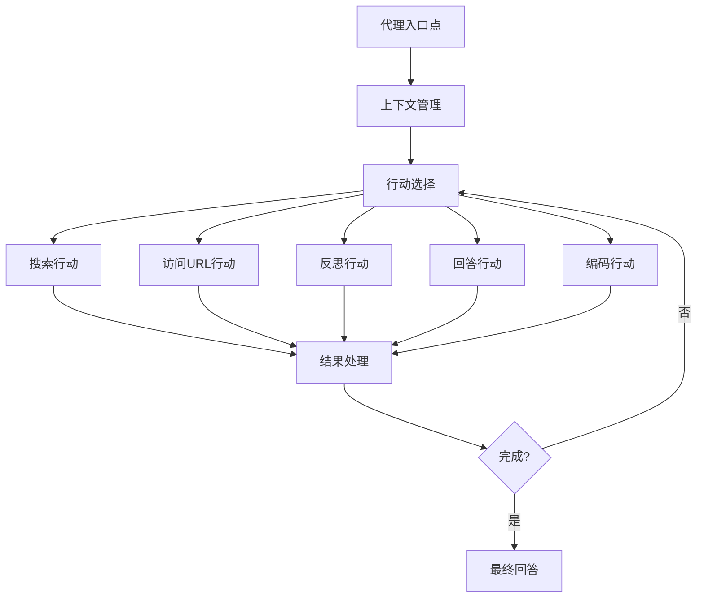
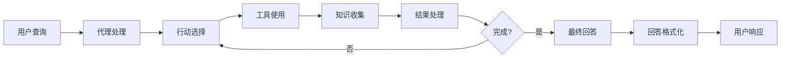
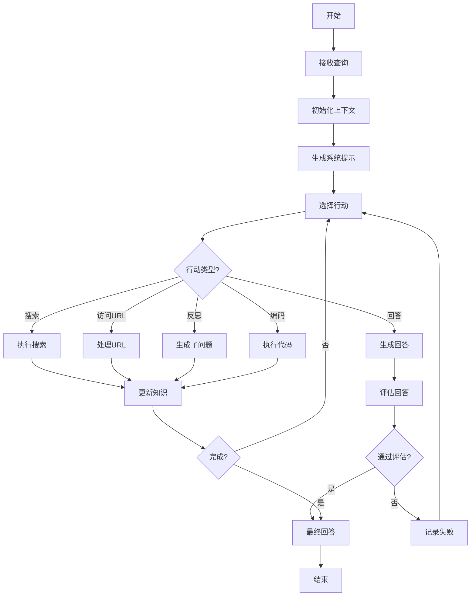

# 代理模块

## 模块概述

代理模块是DeepResearch系统的核心智能组件，负责处理用户查询、执行多步推理、收集信息并生成响应。该模块实现了一个高级AI研究代理，能够使用搜索、URL访问、反思和编码等多种工具来解决复杂问题。代理模块采用递归思考和多步执行的方法，通过分解问题、收集相关信息和综合分析来生成高质量的回答。

## 模块架构

代理模块采用基于行动的架构，将复杂任务分解为一系列离散的行动步骤。每个步骤都涉及选择和执行特定的行动（如搜索、访问URL、反思或回答），然后根据结果决定下一步行动。该模块与各种工具集成，以扩展其能力，并使用评估机制来确保回答的质量。

## 核心组件

| 组件名称 | 描述 | 关键功能 | 文件路径 |
|---------|------|---------|---------|
| 代理入口点 | 处理用户请求并协调代理行动 | 请求处理、上下文管理、响应生成 | src/agent.ts |
| 上下文管理 | 管理代理的上下文和状态 | 知识存储、行动跟踪、令牌跟踪 | src/agent.ts |
| 行动选择 | 选择下一步行动 | 提示生成、模型调用、结果解析 | src/agent.ts |
| 搜索行动 | 执行搜索查询 | 查询重写、搜索执行、结果处理 | src/agent.ts |
| 访问URL行动 | 访问和处理URL内容 | URL选择、内容抓取、信息提取 | src/agent.ts |
| 反思行动 | 分析问题并生成子问题 | 问题分解、知识缺口识别 | src/agent.ts |
| 回答行动 | 生成最终回答 | 答案生成、引用管理、质量评估 | src/agent.ts |
| 编码行动 | 执行代码相关任务 | 问题解析、代码执行、结果处理 | src/agent.ts |
| 评估系统 | 评估回答质量 | 质量检查、改进建议 | src/agent.ts |

## 关键接口

### 公共接口

| 接口名称 | 描述 | 参数 | 返回值 | 使用示例 |
|---------|------|------|--------|---------|
| getResponse | 处理用户查询并生成响应 | 问题、令牌预算、最大尝试次数等 | 包含结果、上下文和URL的对象 | `getResponse("如何使用React?", 1000000, 2)` |
| main | 命令行入口点 | 命令行参数 | 无 | `node agent.js "如何使用React?"` |

### 内部接口

| 接口名称 | 描述 | 参数 | 返回值 |
|---------|------|------|--------|
| executeSearchQueries | 执行搜索查询 | 关键词查询、上下文、URL记录等 | 新知识和搜索查询 |
| processURLs | 处理URL列表 | URL列表、上下文、知识库等 | URL结果和成功标志 |
| updateReferences | 更新引用信息 | 当前步骤、URL记录 | 无 |
| evaluateAnswer | 评估回答质量 | 问题、回答、评估类型等 | 评估结果 |
| storeContext | 存储上下文信息 | 提示、模式、内存、步骤 | 无 |

## 依赖关系

### 外部依赖

| 依赖名称 | 描述 | 依赖类型 | 关键接口 |
|---------|------|---------|---------|
| zod | 模式验证库 | npm包 | ZodObject |
| ai | AI工具库 | npm包 | CoreMessage |
| duck-duck-scrape | DuckDuckGo搜索API | npm包 | search |
| zod-to-json-schema | Zod到JSON模式转换 | npm包 | zodToJsonSchema |

### 被依赖情况

| 模块名称 | 描述 | 依赖类型 | 使用的接口 |
|---------|------|---------|---------|
| 核心服务器模块 | 处理HTTP请求和响应 | 内部模块 | getResponse |
| 工具模块 | 提供各种工具功能 | 内部模块 | 各种工具函数 |
| 实用工具模块 | 提供通用实用功能 | 内部模块 | TokenTracker, ActionTracker |

## 数据流

## 关键算法和流程

### 多步推理流程

### 回答评估算法

1. 接收问题和回答
2. 根据评估类型（新鲜度、相关性、准确性等）生成评估标准
3. 使用模型评估回答质量
4. 如果评估通过，返回成功结果
5. 如果评估失败，生成改进计划
6. 返回评估结果和改进建议

## 配置选项

| 配置项 | 描述 | 默认值 | 可选值 | 影响 |
|--------|------|--------|--------|------|
| SEARCH_PROVIDER | 搜索提供商 | jina | jina, duck, brave, serper | 搜索行动的提供商 |
| STEP_SLEEP | 步骤间延迟 | 1000 | 任何毫秒值 | 步骤执行的延迟时间 |
| MAX_QUERIES_PER_STEP | 每步最大查询数 | 3 | 任何正整数 | 每步可执行的最大搜索查询数 |
| MAX_REFLECT_PER_STEP | 每步最大反思数 | 3 | 任何正整数 | 每步可生成的最大子问题数 |
| MAX_URLS_PER_STEP | 每步最大URL数 | 5 | 任何正整数 | 每步可访问的最大URL数 |

## 错误处理

| 错误类型 | 描述 | 处理方式 | 影响 |
|---------|------|---------|------|
| 搜索错误 | 搜索查询执行失败 | 记录错误并继续下一个查询 | 部分或无搜索结果 |
| URL处理错误 | URL访问或处理失败 | 将URL添加到坏URL列表并继续 | 部分或无URL内容 |
| 评估失败 | 回答未通过评估 | 记录失败原因并重试或进入野兽模式 | 重新生成回答或降级响应 |
| 令牌预算耗尽 | 超出令牌预算限制 | 进入野兽模式生成最终回答 | 可能质量较低的回答 |
| 代码执行错误 | 代码沙箱执行失败 | 记录错误并继续 | 无代码执行结果 |

## 性能考虑

- **关键性能指标**: 响应时间、令牌使用量、回答质量
- **优化策略**: 
  - 使用令牌跟踪控制模型调用成本
  - 实现缓存机制减少重复搜索和URL访问
  - 优先处理高质量信息源
  - 使用野兽模式作为降级策略
- **潜在瓶颈**: 
  - 外部API调用延迟
  - 大型文档处理
  - 复杂查询的多步推理
- **扩展性考虑**: 
  - 模块化工具设计便于添加新功能
  - 可配置的搜索提供商
  - 可调整的令牌预算和评估标准

## 测试策略

- **单元测试**: 测试各个组件和函数的功能
- **集成测试**: 测试代理与工具的集成
- **端到端测试**: 测试完整的查询处理流程
- **测试工具**: Jest

## 实现计划

| 任务名称 | 描述 | 优先级 | 状态 | 依赖任务 |
|---------|------|--------|------|---------|
| 改进评估系统 | 增强回答质量评估机制 | 高 | 进行中 | 无 |
| 添加更多搜索提供商 | 集成更多搜索API | 中 | 计划中 | 无 |
| 优化URL处理 | 改进URL选择和内容提取 | 高 | 待实施 | 无 |
| 增强代码沙箱 | 提高代码执行能力和安全性 | 中 | 待实施 | 无 |

## 修订历史

| 日期 | 版本 | 描述 | 作者 |
|------|------|------|------|
| 2025/4/10 | 1.0 | 初始版本 | CRCT系统 |
