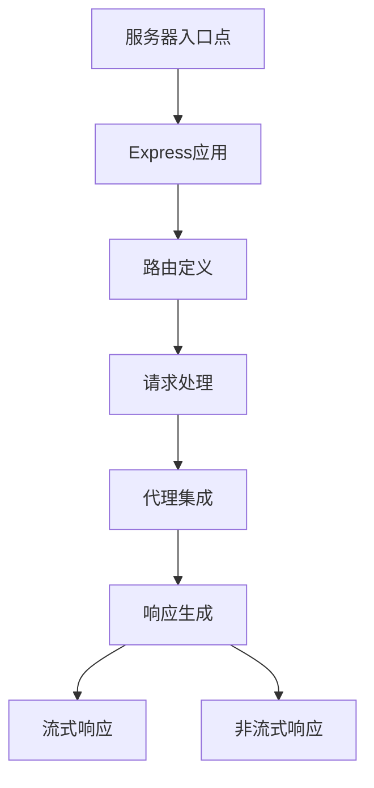
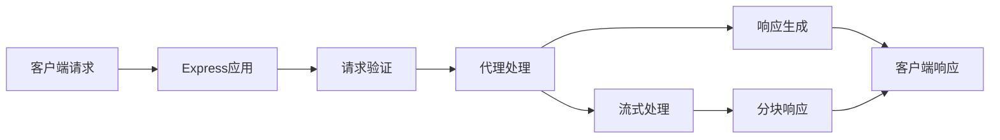
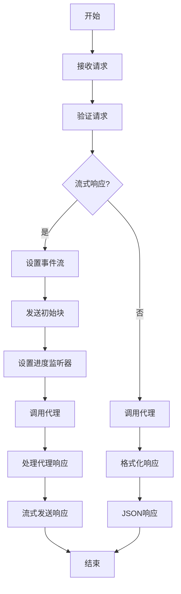

# 核心服务器模块

## 模块概述

核心服务器模块是DeepResearch系统的基础组件，负责处理HTTP请求、路由和API端点管理。该模块提供了一个与OpenAI API兼容的接口，允许客户端发送聊天完成请求并接收响应。核心服务器模块充当系统的入口点，协调其他模块（如代理和工具）的工作，以处理用户请求并生成响应。

## 模块架构

核心服务器模块采用Express框架构建，包含服务器配置、路由定义、请求处理和响应生成等组件。该模块与代理模块紧密集成，将用户请求转发给代理进行处理，并将代理的响应返回给客户端。

## 核心组件

| 组件名称 | 描述 | 关键功能 | 文件路径 |
|---------|------|---------|---------|
| 服务器入口点 | 配置和启动HTTP服务器 | 服务器初始化、端口配置、监听 | src/server.ts |
| Express应用 | 定义Express应用程序和中间件 | 请求解析、CORS配置、认证 | src/app.ts |
| 路由定义 | 定义API端点和路由 | 模型列表、聊天完成、健康检查 | src/app.ts |
| 请求处理 | 处理客户端请求 | 请求验证、参数解析、错误处理 | src/app.ts |
| 代理集成 | 与代理模块集成 | 调用代理、传递参数、处理结果 | src/app.ts |
| 响应生成 | 生成客户端响应 | 格式化响应、添加元数据 | src/app.ts |
| 流式响应 | 处理流式响应 | 分块传输、事件流、自然流式输出 | src/app.ts |

## 关键接口

### 公共接口

| 接口名称 | 描述 | 参数 | 返回值 | 使用示例 |
|---------|------|------|--------|---------|
| GET /health | 健康检查端点 | 无 | `{status: 'ok'}` | `curl http://localhost:3000/health` |
| GET /v1/models | 获取可用模型列表 | 无 | 模型列表JSON | `curl http://localhost:3000/v1/models` |
| GET /v1/models/:model | 获取特定模型信息 | model: 模型ID | 模型信息JSON | `curl http://localhost:3000/v1/models/jina-deepsearch-v1` |
| POST /v1/chat/completions | 聊天完成端点 | 消息数组、模型、流标志等 | 聊天完成响应 | `curl -X POST http://localhost:3000/v1/chat/completions -d '{"messages":[{"role":"user","content":"Hello"}],"model":"jina-deepsearch-v1"}'` |

### 内部接口

| 接口名称 | 描述 | 参数 | 返回值 |
|---------|------|------|--------|
| startServer | 启动HTTP服务器 | 无 | HTTP服务器实例 |
| streamTextNaturally | 自然流式输出文本 | 文本、流式状态 | 文本块生成器 |
| processQueue | 处理流式响应队列 | 流式状态、响应对象、请求ID、创建时间、模型 | 无 |
| completeCurrentStreaming | 完成当前流式输出 | 流式状态、响应对象、请求ID、创建时间、模型 | 无 |

## 依赖关系

### 外部依赖

| 依赖名称 | 描述 | 依赖类型 | 关键接口 |
|---------|------|---------|---------|
| express | Web框架 | npm包 | express(), Router, Request, Response |
| cors | 跨域资源共享中间件 | npm包 | cors() |
| ai | AI工具库 | npm包 | jsonSchema |

### 被依赖情况

| 模块名称 | 描述 | 依赖类型 | 使用的接口 |
|---------|------|---------|---------|
| 代理模块 | 处理用户请求并生成响应 | 内部模块 | getResponse |
| 工具模块 | 提供各种工具功能 | 内部模块 | 各种工具函数 |
| 实用工具模块 | 提供通用实用功能 | 内部模块 | TokenTracker, ActionTracker, ObjectGeneratorSafe |

## 数据流

## 关键算法和流程

### 聊天完成流程

### 自然流式输出算法

1. 将文本分割成块（考虑CJK字符、URL和常规单词）
2. 为每个块计算延迟时间（基于块特性）
3. 按照计算的延迟时间发送每个块
4. 处理特殊情况（如突发模式、URL、标点符号等）

## 配置选项

| 配置项 | 描述 | 默认值 | 可选值 | 影响 |
|--------|------|--------|--------|------|
| PORT | 服务器监听端口 | 3000 | 任何有效端口 | 服务器监听地址 |
| NODE_ENV | 环境模式 | development | development, test, production | 服务器行为（如自动启动） |
| secret | API密钥 | 无 | 任何字符串 | 认证行为 |

## 错误处理

| 错误类型 | 描述 | 处理方式 | 影响 |
|---------|------|---------|------|
| 请求验证错误 | 请求参数无效或缺失 | 返回400状态码和错误消息 | 请求被拒绝 |
| 认证错误 | API密钥无效或缺失 | 返回401状态码和错误消息 | 请求被拒绝 |
| 代理处理错误 | 代理处理请求时出错 | 返回错误消息，保持流式连接 | 部分响应或错误响应 |
| 服务器错误 | 服务器内部错误 | 记录错误并返回错误消息 | 请求失败 |

## 性能考虑

- **关键性能指标**: 请求延迟、吞吐量、并发连接数
- **优化策略**: 
  - 使用异步处理避免阻塞
  - 实现流式响应减少首字节时间
  - 自然流式输出算法模拟人类打字速度
- **潜在瓶颈**: 
  - 代理处理时间
  - 外部API调用延迟
  - 大量并发连接
- **扩展性考虑**: 
  - 模块化设计便于扩展
  - 可配置的端口和认证机制
  - 与代理的松耦合设计

## 测试策略

- **单元测试**: 使用Jest测试框架测试各个组件和函数
- **集成测试**: 测试服务器与代理的集成，验证端到端流程
- **性能测试**: 测试服务器在高负载下的性能和稳定性
- **测试工具**: Jest, Supertest

## 实现计划

| 任务名称 | 描述 | 优先级 | 状态 | 依赖任务 |
|---------|------|--------|------|---------|
| 改进流式响应 | 优化流式响应算法，提高自然度 | 中 | 待实施 | 无 |
| 增强错误处理 | 改进错误处理和报告机制 | 高 | 待实施 | 无 |
| 添加速率限制 | 实现请求速率限制功能 | 中 | 待实施 | 无 |
| 支持更多模型 | 添加对更多模型的支持 | 低 | 待实施 | 无 |

## 修订历史

| 日期 | 版本 | 描述 | 作者 |
|------|------|------|------|
| 2025/4/10 | 1.0 | 初始版本 | CRCT系统 |
