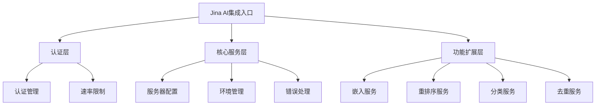
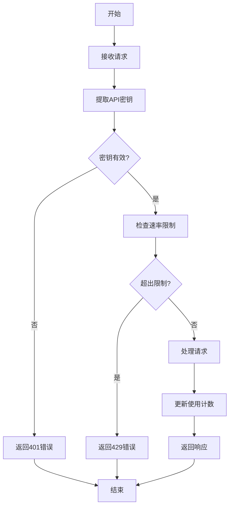

# Jina AI集成模块

## 模块概述

Jina AI集成模块是DeepResearch系统的专用扩展组件，负责与Jina AI服务进行交互，提供嵌入、重排序、分类和去重等高级AI功能。该模块作为DeepResearch系统与Jina AI服务之间的桥梁，封装了API调用、认证、错误处理和数据转换等复杂性，使系统能够无缝地利用Jina AI的强大功能。Jina AI集成模块显著增强了系统的搜索相关性、内容质量评估和重复内容检测能力。

## 模块架构

Jina AI集成模块采用分层架构，包括认证层、核心服务层和功能扩展层。认证层处理API密钥管理和请求认证；核心服务层提供基础服务器功能和环境配置；功能扩展层实现各种专用功能，如嵌入、重排序和分类等。该模块通过Express中间件和路由处理HTTP请求，并使用Firestore进行数据持久化。

## 核心组件

| 组件名称 | 描述 | 关键功能 | 文件路径 |
|---------|------|---------|---------|
| 服务器入口点 | 配置和启动Jina AI集成服务器 | 服务器初始化、中间件配置、路由定义 | jina-ai/src/server.ts |
| Express补丁 | 扩展Express功能 | 请求增强、响应修改 | jina-ai/src/patch-express.ts |
| 速率限制 | 实现API请求速率限制 | 请求计数、限制实施、超限处理 | jina-ai/src/rate-limit.ts |
| 认证管理 | 处理Jina AI认证 | API密钥验证、令牌管理 | jina-ai/src/dto/jina-embeddings-auth.ts |
| 异步上下文 | 管理异步操作上下文 | 上下文存储、检索、清理 | jina-ai/src/lib/async-context.ts |
| 计费管理 | 处理API使用计费 | 使用跟踪、配额管理、计费记录 | jina-ai/src/lib/billing.ts |
| 环境配置 | 管理环境变量和配置 | 配置加载、验证、访问 | jina-ai/src/lib/env-config.ts |
| 错误处理 | 统一错误处理机制 | 错误捕获、格式化、报告 | jina-ai/src/lib/errors.ts |
| Firestore集成 | 与Firestore数据库交互 | 数据存储、检索、更新 | jina-ai/src/lib/firestore.ts |
| 日志管理 | 提供日志记录功能 | 日志格式化、级别控制、输出 | jina-ai/src/lib/logger.ts |
| 注册表管理 | 管理服务和功能注册 | 服务注册、发现、配置 | jina-ai/src/lib/registry.ts |

## 关键接口

### 公共接口

| 接口名称 | 描述 | 参数 | 返回值 | 使用示例 |
|---------|------|------|--------|---------|
| POST /embeddings | 生成文本嵌入 | 文本数组、模型 | 嵌入向量 | `curl -X POST http://localhost:3000/embeddings -d '{"input":["Hello"],"model":"jina-embeddings-v2"}'` |
| POST /rerank | 重排序搜索结果 | 查询、文档数组 | 重排序结果 | `curl -X POST http://localhost:3000/rerank -d '{"query":"React","documents":[{"text":"React教程"}]}'` |
| POST /classify | 分类文本内容 | 文本、类别 | 分类结果 | `curl -X POST http://localhost:3000/classify -d '{"text":"Hello","categories":["greeting","question"]}'` |
| POST /dedup | 检测重复内容 | 文本数组 | 去重结果 | `curl -X POST http://localhost:3000/dedup -d '{"texts":["Hello","Hello world"]}'` |

### 内部接口

| 接口名称 | 描述 | 参数 | 返回值 |
|---------|------|------|--------|
| validateAuth | 验证认证信息 | 请求对象 | 认证结果 |
| rateLimit | 实施速率限制 | 请求对象、限制配置 | 限制结果 |
| trackUsage | 跟踪API使用情况 | 用户ID、操作类型、数量 | 使用记录 |
| handleError | 处理和格式化错误 | 错误对象、响应对象 | 格式化错误 |
| getConfig | 获取环境配置 | 配置键、默认值 | 配置值 |

## 依赖关系

### 外部依赖

| 依赖名称 | 描述 | 依赖类型 | 关键接口 |
|---------|------|---------|---------|
| express | Web框架 | npm包 | express(), Router, Request, Response |
| firebase-admin | Firebase管理SDK | npm包 | initializeApp, firestore |
| axios | HTTP客户端 | npm包 | get, post |
| dotenv | 环境变量加载 | npm包 | config |
| winston | 日志库 | npm包 | createLogger, format, transports |

### 被依赖情况

| 模块名称 | 描述 | 依赖类型 | 使用的接口 |
|---------|------|---------|---------|
| 工具模块 | 提供各种工具功能 | 内部模块 | 嵌入、重排序、分类、去重 |
| 代理模块 | 处理用户查询并生成响应 | 内部模块 | 间接使用 |
| 核心服务器模块 | 处理HTTP请求和响应 | 内部模块 | 间接使用 |

## 数据流

## 关键算法和流程

### 认证和速率限制流程

### 嵌入生成流程

1. 接收文本输入和模型参数
2. 验证输入格式和长度
3. 调用Jina AI嵌入API
4. 处理API响应和错误
5. 格式化并返回嵌入向量

## 配置选项

| 配置项 | 描述 | 默认值 | 可选值 | 影响 |
|--------|------|--------|--------|------|
| PORT | 服务器监听端口 | 3000 | 任何有效端口 | 服务器监听地址 |
| JINA_API_KEY | Jina AI API密钥 | 无 | 有效的API密钥 | API认证 |
| RATE_LIMIT_WINDOW | 速率限制窗口 | 60000 | 任何毫秒值 | 速率限制周期 |
| RATE_LIMIT_MAX | 最大请求数 | 100 | 任何正整数 | 速率限制阈值 |
| LOG_LEVEL | 日志级别 | info | debug, info, warn, error | 日志详细程度 |

## 错误处理

| 错误类型 | 描述 | 处理方式 | 影响 |
|---------|------|---------|------|
| 认证错误 | API密钥无效或缺失 | 返回401状态码和错误消息 | 请求被拒绝 |
| 速率限制错误 | 超出API请求限制 | 返回429状态码和错误消息 | 请求被拒绝 |
| API错误 | Jina AI API调用失败 | 返回相应状态码和错误消息 | 功能失败 |
| 输入验证错误 | 请求参数无效 | 返回400状态码和错误消息 | 请求被拒绝 |
| 服务器错误 | 内部服务器错误 | 返回500状态码和错误消息 | 功能失败 |

## 性能考虑

- **关键性能指标**: API响应时间、吞吐量、错误率
- **优化策略**: 
  - 实现请求批处理减少API调用
  - 使用连接池管理HTTP连接
  - 实现缓存机制减少重复请求
  - 异步处理非阻塞操作
- **潜在瓶颈**: 
  - Jina AI API响应时间
  - 大量并发请求处理
  - 大型文本处理
- **扩展性考虑**: 
  - 水平扩展服务器实例
  - 负载均衡多个实例
  - 可配置的资源限制

## 测试策略

- **单元测试**: 测试各个组件和函数的功能
- **集成测试**: 测试模块与Jina AI API的集成
- **性能测试**: 测试在高负载下的性能和稳定性
- **测试工具**: Jest, Supertest, Nock

## 实现计划

| 任务名称 | 描述 | 优先级 | 状态 | 依赖任务 |
|---------|------|--------|------|---------|
| 增强错误处理 | 改进错误处理和报告机制 | 高 | 待实施 | 无 |
| 添加缓存层 | 实现API响应缓存 | 中 | 待实施 | 无 |
| 改进计费系统 | 增强使用跟踪和计费功能 | 中 | 计划中 | 无 |
| 支持更多Jina AI模型 | 添加对新模型的支持 | 低 | 待实施 | 无 |

## 修订历史

| 日期 | 版本 | 描述 | 作者 |
|------|------|------|------|
| 2025/4/10 | 1.0 | 初始版本 | CRCT系统 |
