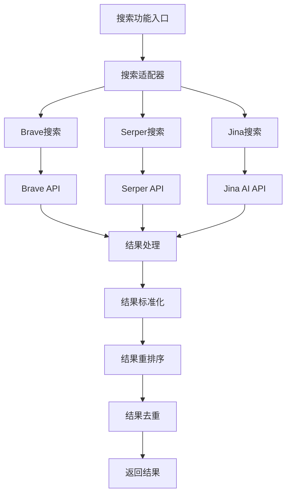
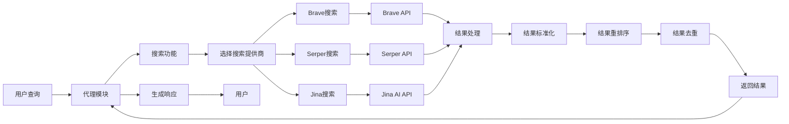
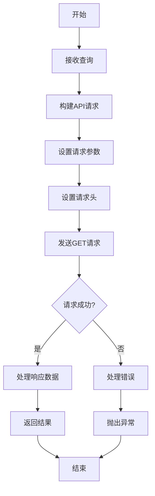
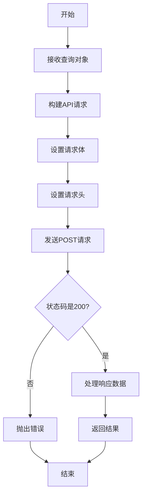
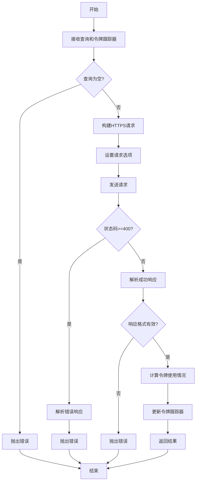
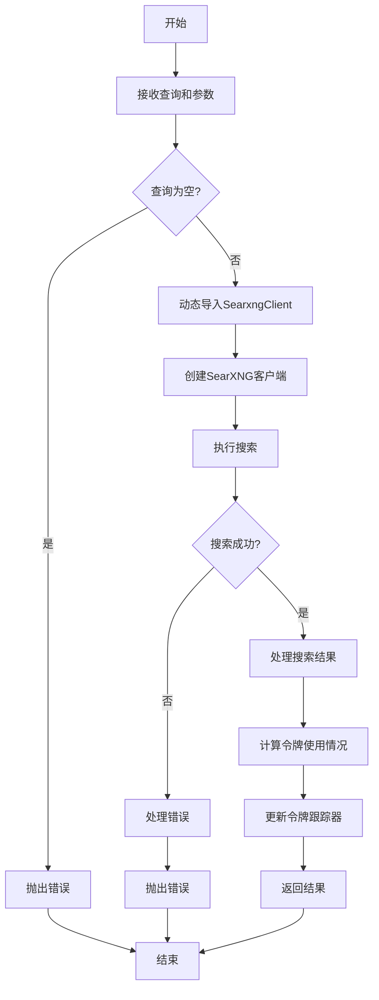

# 搜索功能实现计划

## 功能概述

搜索功能是DeepResearch系统的核心能力之一，允许系统从多个来源获取信息以响应用户查询。该功能集成了多个搜索提供商（Brave、Serper和Jina），提供了全面的搜索能力，包括网络搜索、结果处理、重排序和去重。搜索功能作为代理模块的关键支持工具，显著增强了系统回答问题和提供信息的能力，使系统能够访问最新和最相关的信息。

## 架构设计

搜索功能采用适配器模式，为不同的搜索提供商提供统一的接口。每个搜索提供商都有自己的实现，但通过统一的数据结构和接口进行交互。这种设计允许系统轻松切换或组合不同的搜索提供商，同时保持一致的使用体验。



## 核心组件

| 组件名称 | 描述 | 关键功能 | 文件路径 |
|---------|------|---------|---------|
| Brave搜索 | 使用Brave搜索API | 执行网络搜索、处理结果 | src/tools/brave-search.ts |
| Serper搜索 | 使用Serper搜索API | 执行Google搜索、处理结果 | src/tools/serper-search.ts |
| Jina搜索 | 使用Jina AI搜索服务 | 执行语义搜索、处理结果 | src/tools/jina-search.ts |
| SearXNG搜索 | 使用SearXNG元搜索引擎 | 执行多引擎搜索、处理结果 | src/tools/searxng-search.ts |
| 搜索测试 | 测试搜索功能 | 验证搜索功能正确性 | src/tools/__tests__/search.test.ts |
| 类型定义 | 定义搜索相关类型 | 提供类型安全 | src/types.ts |

## 接口定义

### 公共接口

| 接口名称 | 描述 | 参数 | 返回值 | 使用示例 |
|---------|------|------|--------|---------|
| braveSearch | 使用Brave搜索引擎 | query: string | { response: BraveSearchResponse } | `braveSearch("React教程")` |
| serperSearch | 使用Serper搜索API | query: SERPQuery | { response: SerperSearchResponse } | `serperSearch({q: "React教程"})` |
| search | 使用Jina搜索 | query: string, tracker?: TokenTracker | { response: SearchResponse } | `search("React教程", tokenTracker)` |
| searxngSearch | 使用SearXNG元搜索引擎 | query: string, categories?: string[], engines?: string[], language?: string, tracker?: TokenTracker | { response: SearxngSearchResponse } | `searxngSearch("React教程", ["general"], ["google", "bing"], "zh-CN", tokenTracker)` |

### 数据结构

#### 搜索请求

```typescript
// Serper搜索请求
type SERPQuery = {
  q: string,
  hl?: string,
  gl?: string,
  location?: string,
  tbs?: string,
}

// SearXNG搜索请求
interface SearxngSearchOptions {
  query: string;
  categories?: string[];
  engines?: string[];
  language?: string;
  pageno?: number;
}
```

#### 搜索响应

```typescript
// Brave搜索响应
interface BraveSearchResponse {
  web: {
    results: Array<{
      title: string;
      description: string;
      url: string;
    }>;
  };
}

// Serper搜索响应
interface SerperSearchResponse {
  knowledgeGraph?: {
    title: string;
    type: string;
    website: string;
    imageUrl: string;
    description: string;
    descriptionSource: string;
    descriptionLink: string;
    attributes: { [k: string]: string; };
  },
  organic: {
    title: string;
    link: string;
    snippet: string;
    date: string;
    siteLinks?: { title: string; link: string; }[];
    position: number,
  }[];
  topStories?: {
    title: string;
    link: string;
    source: string;
    data: string;
    imageUrl: string;
  }[];
  relatedSearches?: string[];
  credits: number;
}

// Jina搜索响应
interface SearchResponse {
  code: number;
  status: number;
  data: Array<{
    title: string;
    description: string;
    url: string;
    content: string;
    usage: { tokens: number; };
  }> | null;
  name?: string;
  message?: string;
  readableMessage?: string;
}

// SearXNG搜索结果
interface SearxngSearchResult {
  title: string;
  url: string;
  content?: string;
  img_src?: string;
  thumbnail_src?: string;
  thumbnail?: string;
  author?: string;
  publishedDate?: string;
}

// SearXNG搜索响应
interface SearxngSearchResponse {
  results: SearxngSearchResult[];
  suggestions: string[];
  query: string;
}
```

#### 标准化搜索片段

```typescript
// 未标准化的搜索片段
type UnNormalizedSearchSnippet = {
  title: string;
  url?: string;
  description?: string;
  link?: string;
  snippet?: string;
  weight?: number,
  date?: string
};

// 标准化的搜索片段
type SearchSnippet = UnNormalizedSearchSnippet & {
  url: string;
  description: string;
};

// 增强的搜索片段（用于重排序）
type BoostedSearchSnippet = SearchSnippet & {
  freqBoost: number;
  hostnameBoost: number;
  pathBoost: number;
  jinaRerankBoost: number;
  finalScore: number;
}
```

## 依赖关系

### 外部依赖

| 依赖名称 | 描述 | 依赖类型 | 关键接口 |
|---------|------|---------|---------|
| axios | HTTP客户端 | npm包 | get, post |
| https | Node.js HTTPS模块 | 内置模块 | request |
| @agentic/searxng | SearXNG客户端 | npm包 | SearxngClient, search |
| BRAVE_API_KEY | Brave搜索API密钥 | 环境变量 | - |
| SERPER_API_KEY | Serper搜索API密钥 | 环境变量 | - |
| JINA_API_KEY | Jina AI API密钥 | 环境变量 | - |
| SEARXNG_API_BASE_URL | SearXNG API基础URL | 环境变量 | - |

### 被依赖情况

| 模块名称 | 描述 | 依赖类型 | 使用的接口 |
|---------|------|---------|---------|
| 代理模块 | 处理用户查询并生成响应 | 内部模块 | braveSearch, serperSearch, search |
| 工具集模块 | 提供各种工具功能 | 内部模块 | 包含搜索功能 |
| TokenTracker | 跟踪令牌使用情况 | 内部类 | trackUsage |

## 数据流



## 关键算法和流程

### 搜索流程

1. **查询接收**：接收用户查询字符串
2. **搜索提供商选择**：根据需求选择适当的搜索提供商
3. **API调用**：调用相应的搜索API
4. **结果处理**：处理API响应
5. **错误处理**：处理可能的错误情况
6. **令牌跟踪**：跟踪令牌使用情况（对于Jina搜索）
7. **返回结果**：返回标准化的搜索结果

### Brave搜索流程



### Serper搜索流程



### Jina搜索流程



### SearXNG搜索流程



## 配置选项

| 配置项 | 描述 | 默认值 | 可选值 | 影响 |
|--------|------|--------|--------|------|
| BRAVE_API_KEY | Brave搜索API密钥 | 无 | 有效的API密钥 | Brave搜索功能 |
| SERPER_API_KEY | Serper搜索API密钥 | 无 | 有效的API密钥 | Serper搜索功能 |
| JINA_API_KEY | Jina AI API密钥 | 无 | 有效的API密钥 | Jina搜索功能 |
| SEARXNG_API_BASE_URL | SearXNG API基础URL | http://localhost:28000 | 有效的URL | SearXNG搜索功能 |
| 超时设置 | 请求超时时间 | Brave/Serper: 10000ms, Jina: 30000ms | 任何毫秒值 | 请求超时行为 |
| 结果数量 | 返回的结果数量 | Brave: 10 | 任何正整数 | 搜索结果数量 |
| 安全搜索 | 是否启用安全搜索 | Brave: 'off' | 'off', 'moderate', 'strict' | 过滤不适当内容 |
| 搜索类别 | SearXNG搜索类别 | general | general, images, videos, news, map, music, it, science, files, social media | 搜索结果类型 |
| 搜索引擎 | SearXNG搜索引擎 | 无 | google, bing, brave, duckduckgo, reddit, github等 | 搜索结果来源 |

## 错误处理

| 错误类型 | 描述 | 处理方式 | 影响 |
|---------|------|---------|------|
| 空查询错误 | 查询字符串为空 | 抛出错误 | 搜索失败 |
| API错误 | 外部API调用失败 | 抛出错误并包含状态码和消息 | 搜索失败 |
| 超时错误 | 请求超时 | 抛出超时错误 | 搜索失败 |
| 解析错误 | 响应解析失败 | 抛出格式错误 | 搜索失败 |
| 格式错误 | 响应格式无效 | 抛出格式错误 | 搜索失败 |
| 网络错误 | 网络连接问题 | 抛出网络错误 | 搜索失败 |

## 性能考虑

- **关键性能指标**: 响应时间、准确性、资源使用
- **优化策略**: 
  - 实现缓存机制减少重复API调用
  - 并行处理多个搜索提供商的请求
  - 设置合理的超时时间
  - 实现重试机制处理临时失败
- **潜在瓶颈**: 
  - 外部API响应时间
  - 大量并发请求处理
  - API速率限制
- **扩展性考虑**: 
  - 添加更多搜索提供商
  - 实现负载均衡策略
  - 优化结果处理和合并算法

## 测试策略

### 单元测试

- 测试各个搜索提供商的功能
- 测试错误处理和边缘情况
- 使用模拟数据测试响应处理

### 集成测试

- 测试与实际API的集成
- 测试与代理模块的集成
- 测试与令牌跟踪器的集成

### 性能测试

- 测试在高负载下的性能
- 测试并发请求处理
- 测试超时和重试机制

### 测试用例

| 测试名称 | 描述 | 预期结果 |
|---------|------|---------|
| 基本搜索测试 | 测试基本搜索功能 | 返回有效的搜索结果 |
| 空查询测试 | 测试空查询处理 | 抛出错误 |
| API错误测试 | 测试API错误处理 | 抛出错误并包含状态码和消息 |
| 超时测试 | 测试请求超时处理 | 抛出超时错误 |
| 令牌跟踪测试 | 测试令牌使用跟踪 | 正确更新令牌跟踪器 |

## 实现计划

| 任务名称 | 描述 | 优先级 | 状态 | 依赖任务 |
|---------|------|---------|------|---------|
| SearXNG搜索集成 | 集成SearXNG元搜索引擎 | 高 | 已完成 | 无 |
| 搜索结果合并 | 实现多提供商结果合并 | 高 | 待实施 | 无 |
| 搜索结果缓存 | 实现搜索结果缓存 | 中 | 待实施 | 无 |
| 添加更多提供商 | 集成更多搜索API | 中 | 计划中 | 无 |
| 改进重排序算法 | 优化搜索结果相关性 | 高 | 待实施 | 无 |
| 多语言搜索支持 | 增强多语言搜索能力 | 中 | 计划中 | 无 |
| 搜索结果过滤 | 实现内容过滤功能 | 低 | 待实施 | 无 |
| 搜索分析 | 添加搜索使用分析 | 低 | 计划中 | 无 |
| SearXNG搜索测试 | 测试SearXNG搜索功能 | 高 | 待实施 | SearXNG搜索集成 |
| SearXNG搜索优化 | 优化SearXNG搜索性能和结果质量 | 中 | 待实施 | SearXNG搜索集成, SearXNG搜索测试 |

## 修订历史

| 日期 | 版本 | 描述 | 作者 |
|------|------|------|------|
| 2025/4/10 | 1.0 | 初始版本 | CRCT系统 |
| 2025/4/10 | 1.1 | 添加SearXNG搜索功能 | CRCT系统 |
