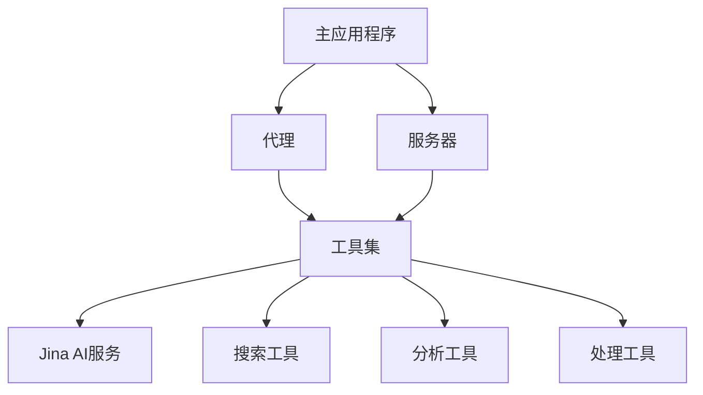

# 系统清单

## 项目概述

node-DeepResearch是一个基于Node.js的深度研究工具，旨在提供高级搜索、分析和处理功能。该项目集成了多种工具和服务，如Jina AI的嵌入和搜索功能，以增强信息检索和处理能力。

## 系统架构

该系统由主要的核心组件和Jina AI集成组件组成，提供了一系列工具和实用程序来支持深度研究和分析。

## 核心模块

| 模块名称 | 路径 | 主要功能 | 依赖关系 |
|---------|------|---------|---------|
| 主应用程序 | src/app.ts | 应用程序入口点 | 代理, 服务器 |
| 代理 | src/agent.ts | 处理代理功能 | 工具集 |
| 服务器 | src/server.ts | 提供API服务 | 工具集 |
| 配置 | src/config.ts | 管理应用程序配置 | 无 |
| CLI | src/cli.ts | 命令行界面 | 应用程序 |
| 工具集 | src/tools/ | 提供各种工具功能 | Jina AI服务 |
| Jina AI集成 | jina-ai/src/ | 集成Jina AI服务 | 无 |

## 技术栈

- 编程语言：TypeScript
- 框架：Node.js
- 数据库：未明确指定
- 其他工具：
  - Docker (用于容器化)
  - Jest (用于测试)
  - ESLint (用于代码质量)
  - Jina AI API (用于嵌入和搜索功能)

## 开发环境

- 操作系统：跨平台（通过Docker支持）
- 依赖项：见package.json
- 环境变量：可能在config.json中定义
- 构建工具：npm/yarn

## 部署流程

1. 克隆代码库
2. 安装依赖项 (`npm install`)
3. 配置环境变量或config.json
4. 构建项目 (`npm run build`)
5. 启动应用程序 (`npm start`)
6. 或者使用Docker部署 (`docker-compose up`)

## 未来计划

- 短期目标：完善现有工具集，提高稳定性
- 中期目标：扩展Jina AI集成，增加更多搜索和分析功能
- 长期目标：开发更高级的深度研究功能，可能包括机器学习模型集成
