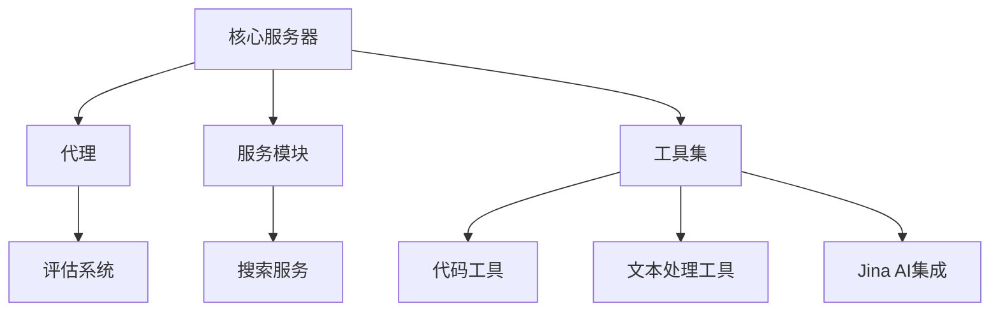

# 系统清单

## 项目概述

DeepResearch是一个基于Node.js的AI基础设施项目，旨在提供强大的深度研究和增强功能，包括搜索、去重、错误分析、代码沙箱等工具。该项目设计用于增强AI系统的能力，提供更准确、更相关的信息检索和处理功能。

## 系统架构

DeepResearch采用模块化架构，由核心服务器、代理、服务模块和一系列专用工具组成。系统还包括一个Jina AI集成模块，提供嵌入、重排序和分类功能。

## 核心模块

| 模块名称 | 描述 | 关键功能 | 依赖关系 |
|---------|------|---------|---------|
| 核心服务器 | 处理请求并协调系统组件 | 请求处理、路由、配置管理 | 服务模块、工具集、代理 |
| 代理 | 执行任务并管理工作流 | 任务执行、上下文管理、错误处理 | 服务模块、工具集、评估系统 |
| 服务模块 | 提供各种服务功能 | 搜索服务、数据处理、分析 | 工具集、Jina AI集成 |
| 工具集 | 提供各种专用功能的工具集合 | 代码处理、文本处理、去重 | Jina AI集成 |
| Jina AI集成 | 提供AI增强功能 | 嵌入、重排序、分类、去重 | 外部Jina AI服务 |

## 技术栈

- **编程语言**: TypeScript, JavaScript
- **框架**: Node.js, Express
- **数据库**: Firestore (通过Jina AI集成)
- **其他工具**: Jest (测试), ESLint (代码质量), Docker (容器化)

## 开发状态

- **已完成**: 核心服务器、基本工具集、Jina AI集成、搜索服务重构
- **进行中**: 评估系统改进、服务模块扩展、工具扩展
- **计划中**: 更多搜索提供商集成、高级错误分析、改进的代码沙箱

## 关键挑战和解决方案

| 挑战 | 解决方案 | 状态 |
|------|---------|------|
| 搜索结果质量 | 实现重排序和去重功能 | 已解决 |
| 错误处理和分析 | 开发专用错误分析工具 | 进行中 |
| 代码执行安全性 | 实现隔离的代码沙箱 | 已解决 |
| 系统性能和扩展性 | 模块化设计和异步处理 | 进行中 |

## 系统边界和接口

- **输入**: HTTP请求、查询字符串、代码片段
- **输出**: 搜索结果、分析报告、处理后的文本
- **外部依赖**: Jina AI服务、Brave搜索API、Serper搜索API
- **API**: RESTful API接口

## 质量属性

- **性能**: 异步处理、缓存机制、高效算法
- **安全性**: 请求验证、速率限制、代码沙箱隔离
- **可靠性**: 错误处理、重试机制、日志记录
- **可扩展性**: 模块化设计、插件架构、容器化部署

## 项目路线图

- **短期目标** (1-3个月): 完善评估系统、增加更多工具、改进文档
- **中期目标** (3-6个月): 增强搜索功能、改进错误分析、优化性能
- **长期目标** (6个月以上): 支持更多语言和框架、高级AI集成、分布式部署

## 文档结构

- **系统清单** (本文档): 提供系统的高级概述
- **域模块文档**: 详细描述每个模块的功能和实现
- **实现计划**: 描述特定功能的实现细节
- **任务指令**: 提供具体任务的执行步骤

## 修订历史

| 日期 | 版本 | 描述 | 作者 |
|------|------|------|------|
| 2025/4/10 | 1.0 | 初始版本 | CRCT系统 |
| 2025/4/10 | 1.1 | 更新系统架构，添加服务模块 | CRCT系统 |
