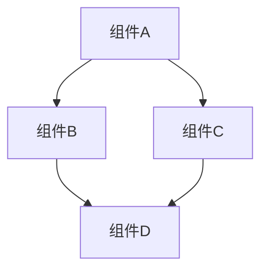
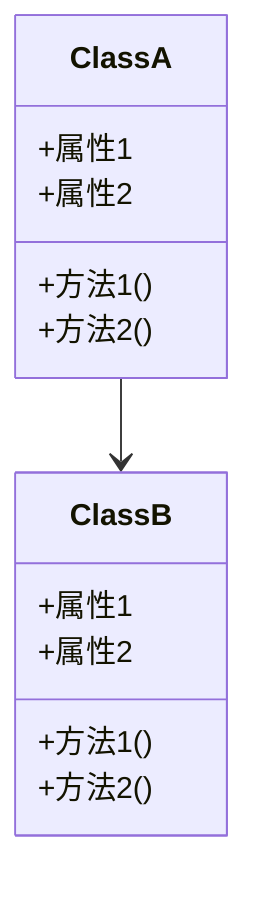
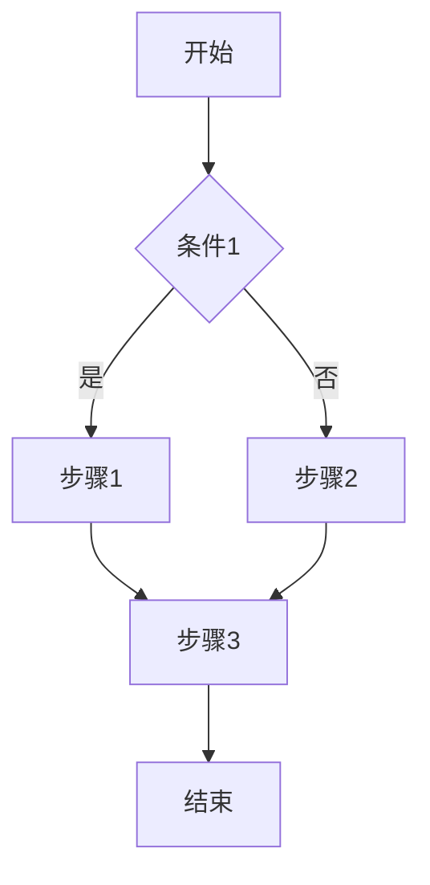

# [实现名称] 实现计划

## 概述

[提供实现的高级概述，包括其目的、范围和在模块中的角色。]

## 目标

[明确定义实现的具体目标和成功标准。]

- 目标1: [描述]
- 目标2: [描述]
- 目标3: [描述]

## 设计决策

[描述关键设计决策和理由。]

| 决策 | 描述 | 理由 | 替代方案 | 影响 |
|------|------|------|---------|------|
| 决策1 | [描述] | [理由] | [替代方案] | [影响] |
| 决策2 | [描述] | [理由] | [替代方案] | [影响] |
| 决策3 | [描述] | [理由] | [替代方案] | [影响] |

## 组件

[描述实现的主要组件和它们之间的关系。]



### 组件详情

| 组件名称 | 描述 | 责任 | 文件路径 |
|---------|------|------|---------|
| 组件A | [描述] | [责任] | [文件路径] |
| 组件B | [描述] | [责任] | [文件路径] |
| 组件C | [描述] | [责任] | [文件路径] |

## 接口

[描述组件之间的接口和交互。]

### 内部接口

| 接口名称 | 提供者 | 消费者 | 描述 | 参数 | 返回值 |
|---------|--------|--------|------|------|--------|
| 接口A | [提供者] | [消费者] | [描述] | [参数] | [返回值] |
| 接口B | [提供者] | [消费者] | [描述] | [参数] | [返回值] |
| 接口C | [提供者] | [消费者] | [描述] | [参数] | [返回值] |

### 外部接口

[描述实现与外部系统的接口。]

| 接口名称 | 方向 | 外部系统 | 描述 | 参数 | 返回值 |
|---------|------|---------|------|------|--------|
| 接口X | [输入/输出] | [系统] | [描述] | [参数] | [返回值] |
| 接口Y | [输入/输出] | [系统] | [描述] | [参数] | [返回值] |
| 接口Z | [输入/输出] | [系统] | [描述] | [参数] | [返回值] |

## 依赖关系

[描述实现的依赖关系。]

### 内部依赖

[描述对模块内其他组件的依赖。]

| 依赖名称 | 描述 | 依赖类型 | 影响 |
|---------|------|---------|------|
| 依赖A | [描述] | [类型] | [影响] |
| 依赖B | [描述] | [类型] | [影响] |
| 依赖C | [描述] | [类型] | [影响] |

### 外部依赖

[描述对外部模块或系统的依赖。]

| 依赖名称 | 描述 | 依赖类型 | 影响 |
|---------|------|---------|------|
| 依赖X | [描述] | [类型] | [影响] |
| 依赖Y | [描述] | [类型] | [影响] |
| 依赖Z | [描述] | [类型] | [影响] |

## 数据模型

[描述实现使用的数据模型和结构。]



## 算法和流程

[描述实现中使用的关键算法和流程。]

### 算法A

[描述算法A的目的、输入、输出和实现细节。]

```
伪代码或流程图
```

### 流程B

[描述流程B的步骤、条件和分支。]



## 错误处理

[描述实现的错误处理策略和机制。]

| 错误类型 | 描述 | 处理方式 | 影响 |
|---------|------|---------|------|
| 错误A | [描述] | [处理方式] | [影响] |
| 错误B | [描述] | [处理方式] | [影响] |
| 错误C | [描述] | [处理方式] | [影响] |

## 性能考虑

[描述实现的性能特征、优化策略和潜在瓶颈。]

- **关键性能指标**: [列出关键性能指标]
- **优化策略**: [描述优化策略]
- **潜在瓶颈**: [描述潜在瓶颈]
- **资源使用**: [描述资源使用情况]

## 测试策略

[描述实现的测试策略和方法。]

### 单元测试

[描述单元测试方法和覆盖范围。]

| 测试用例 | 描述 | 预期结果 | 测试数据 |
|---------|------|---------|---------|
| 测试A | [描述] | [预期结果] | [测试数据] |
| 测试B | [描述] | [预期结果] | [测试数据] |
| 测试C | [描述] | [预期结果] | [测试数据] |

### 集成测试

[描述集成测试方法和覆盖范围。]

### 性能测试

[描述性能测试方法和指标。]

## 实现步骤

[列出实现的具体步骤和任务。]

| 步骤 | 描述 | 优先级 | 估计时间 | 依赖步骤 |
|------|------|--------|---------|---------|
| 步骤1 | [描述] | [优先级] | [估计时间] | [依赖步骤] |
| 步骤2 | [描述] | [优先级] | [估计时间] | [依赖步骤] |
| 步骤3 | [描述] | [优先级] | [估计时间] | [依赖步骤] |

## 风险和缓解策略

[描述实现过程中的潜在风险和缓解策略。]

| 风险 | 描述 | 影响 | 可能性 | 缓解策略 |
|------|------|------|--------|---------|
| 风险A | [描述] | [影响] | [可能性] | [缓解策略] |
| 风险B | [描述] | [影响] | [可能性] | [缓解策略] |
| 风险C | [描述] | [影响] | [可能性] | [缓解策略] |

## 修订历史

| 日期 | 版本 | 描述 | 作者 |
|------|------|------|------|
| [日期] | [版本] | [描述] | [作者] |
| [日期] | [版本] | [描述] | [作者] |
| [日期] | [版本] | [描述] | [作者] |
