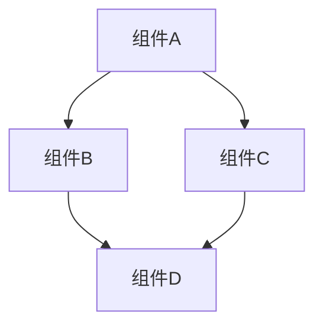

# 系统清单

## 项目概述

[提供项目的高级概述，包括其目的、主要功能和目标用户。]

## 系统架构

[描述系统的整体架构，包括主要组件、模块和它们之间的关系。]

## 核心模块

[列出系统的核心模块及其功能。]

| 模块名称 | 路径 | 主要功能 | 依赖关系 |
|---------|------|---------|---------|
| 模块1 | /path/to/module1 | 功能描述 | 模块2, 模块3 |
| 模块2 | /path/to/module2 | 功能描述 | 模块4 |
| 模块3 | /path/to/module3 | 功能描述 | 无 |

## 技术栈

[描述项目使用的主要技术、框架、库和工具。]

- 编程语言：
- 框架：
- 数据库：
- 其他工具：

## 开发环境

[描述设置和运行项目所需的开发环境。]

- 操作系统：
- 依赖项：
- 环境变量：
- 构建工具：

## 部署流程

[描述项目的部署流程和环境。]

1. 步骤1
2. 步骤2
3. 步骤3

## 未来计划

[描述项目的未来计划和路线图。]

- 短期目标：
- 中期目标：
- 长期目标：
