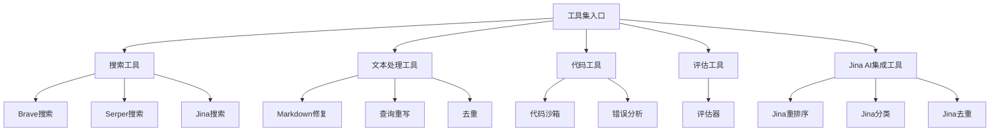
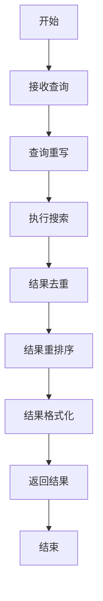

# 工具集模块

## 模块概述

工具集模块是DeepResearch系统的功能扩展组件，提供了一系列专用工具，用于增强代理模块的能力。该模块包含多种工具，如搜索工具、文本处理工具、代码工具和Jina AI集成工具等，每种工具都专注于特定的功能领域。工具集模块使代理能够执行搜索、重排序、去重、错误分析、代码执行等多种操作，从而提高系统的整体性能和响应质量。

## 模块架构

工具集模块采用插件式架构，每个工具都是独立的功能单元，可以被代理模块调用。工具之间可以相互协作，形成功能链，以处理复杂的任务。该模块与代理模块松耦合，通过明确定义的接口进行交互，便于扩展和维护。

## 核心组件

| 组件名称 | 描述 | 关键功能 | 文件路径 |
|---------|------|---------|---------|
| 搜索工具 | 提供多种搜索功能 | 网络搜索、结果处理 | src/tools/brave-search.ts, src/tools/serper-search.ts, src/tools/jina-search.ts |
| 文本处理工具 | 处理和优化文本内容 | Markdown修复、查询重写、文本去重 | src/tools/md-fixer.ts, src/tools/query-rewriter.ts, src/tools/dedup.ts |
| 代码工具 | 处理代码相关任务 | 代码执行、错误分析 | src/tools/code-sandbox.ts, src/tools/error-analyzer.ts |
| 评估工具 | 评估回答质量 | 质量检查、改进建议 | src/tools/evaluator.ts |
| Jina AI集成工具 | 集成Jina AI功能 | 重排序、分类、去重 | src/tools/jina-rerank.ts, src/tools/jina-classify-spam.ts, src/tools/jina-dedup.ts |
| 实用工具 | 提供通用功能 | URL读取、字符修复 | src/tools/read.ts, src/tools/broken-ch-fixer.ts |

## 关键接口

### 公共接口

| 接口名称 | 描述 | 参数 | 返回值 | 使用示例 |
|---------|------|------|--------|---------|
| braveSearch | 使用Brave搜索引擎 | 查询字符串 | 搜索结果对象 | `braveSearch("React教程")` |
| serperSearch | 使用Serper搜索API | 查询对象 | 搜索结果对象 | `serperSearch({q: "React教程"})` |
| search | 使用Jina搜索 | 查询字符串、令牌跟踪器 | 搜索结果对象 | `search("React教程", tokenTracker)` |
| evaluateAnswer | 评估回答质量 | 问题、回答、评估类型等 | 评估结果 | `evaluateAnswer("如何使用React?", answer, ["accuracy"])` |
| CodeSandbox | 代码沙箱类 | 上下文、跟踪器 | 代码沙箱实例 | `new CodeSandbox(context, tracker)` |

### 内部接口

| 接口名称 | 描述 | 参数 | 返回值 |
|---------|------|------|--------|
| rewriteQuery | 重写搜索查询 | 步骤、声音字节、上下文等 | 重写的查询 |
| dedupQueries | 去除重复查询 | 查询数组、已有查询、令牌跟踪器 | 唯一查询 |
| analyzeSteps | 分析步骤并提供改进 | 日记上下文、跟踪器等 | 分析结果 |
| fixMarkdown | 修复Markdown格式 | Markdown文本、知识库等 | 修复后的文本 |
| repairUnknownChars | 修复未知字符 | 文本、上下文 | 修复后的文本 |

## 依赖关系

### 外部依赖

| 依赖名称 | 描述 | 依赖类型 | 关键接口 |
|---------|------|---------|---------|
| axios | HTTP客户端 | npm包 | get, post |
| cheerio | HTML解析 | npm包 | load, $ |
| vm | Node.js虚拟机 | 内置模块 | runInNewContext |
| zod | 模式验证 | npm包 | z.object, z.string |

### 被依赖情况

| 模块名称 | 描述 | 依赖类型 | 使用的接口 |
|---------|------|---------|---------|
| 代理模块 | 处理用户查询并生成响应 | 内部模块 | 各种工具函数 |
| 核心服务器模块 | 处理HTTP请求和响应 | 内部模块 | 间接使用 |
| 实用工具模块 | 提供通用实用功能 | 内部模块 | 各种实用函数 |

## 数据流

## 关键算法和流程

### 搜索和重排序流程

### 代码沙箱执行流程

1. 接收代码问题描述
2. 生成解决方案代码
3. 在隔离环境中执行代码
4. 捕获执行结果和错误
5. 格式化并返回结果

## 配置选项

| 配置项 | 描述 | 默认值 | 可选值 | 影响 |
|--------|------|--------|--------|------|
| BRAVE_API_KEY | Brave搜索API密钥 | 无 | 有效的API密钥 | Brave搜索功能 |
| SERPER_API_KEY | Serper搜索API密钥 | 无 | 有效的API密钥 | Serper搜索功能 |
| JINA_API_KEY | Jina AI API密钥 | 无 | 有效的API密钥 | Jina AI集成功能 |
| CODE_TIMEOUT | 代码执行超时时间 | 5000 | 任何毫秒值 | 代码沙箱执行时间限制 |
| MAX_SEARCH_RESULTS | 最大搜索结果数 | 10 | 任何正整数 | 搜索结果数量限制 |

## 错误处理

| 错误类型 | 描述 | 处理方式 | 影响 |
|---------|------|---------|------|
| API错误 | 外部API调用失败 | 记录错误并返回空结果 | 功能降级 |
| 超时错误 | 操作超时 | 中断操作并返回部分结果 | 部分功能 |
| 代码执行错误 | 代码沙箱执行失败 | 捕获错误并返回错误信息 | 执行失败但不影响系统 |
| 格式错误 | 输入格式无效 | 尝试修复或返回错误 | 可能的功能降级 |
| 资源限制错误 | 超出资源限制 | 优雅降级并返回部分结果 | 功能受限 |

## 性能考虑

- **关键性能指标**: 响应时间、准确性、资源使用
- **优化策略**: 
  - 实现缓存机制减少重复API调用
  - 并行处理独立任务
  - 优先处理高价值操作
  - 实现超时和重试机制
- **潜在瓶颈**: 
  - 外部API调用延迟
  - 代码执行资源消耗
  - 大量并发请求处理
- **扩展性考虑**: 
  - 插件式架构便于添加新工具
  - 统一的接口设计
  - 可配置的资源限制

## 测试策略

- **单元测试**: 测试各个工具的独立功能
- **集成测试**: 测试工具之间的协作
- **模拟测试**: 使用模拟数据测试外部依赖
- **测试工具**: Jest, Nock

## 实现计划

| 任务名称 | 描述 | 优先级 | 状态 | 依赖任务 |
|---------|------|--------|------|---------|
| 添加更多搜索提供商 | 集成更多搜索API | 中 | 计划中 | 无 |
| 改进代码沙箱 | 增强代码执行能力和安全性 | 高 | 待实施 | 无 |
| 优化重排序算法 | 提高搜索结果相关性 | 高 | 进行中 | 无 |
| 添加多语言支持 | 支持更多语言的文本处理 | 中 | 待实施 | 无 |

## 修订历史

| 日期 | 版本 | 描述 | 作者 |
|------|------|------|------|
| 2025/4/10 | 1.0 | 初始版本 | CRCT系统 |
